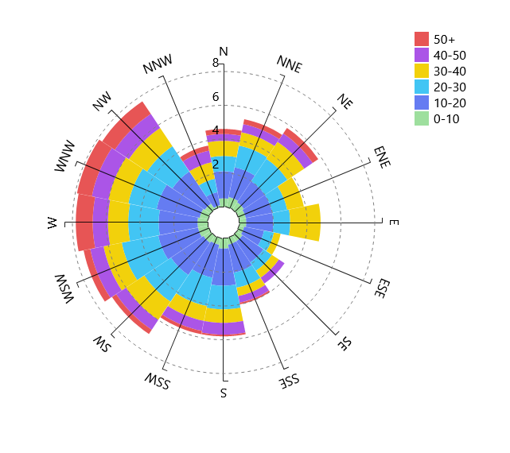

# Windrose Chart Component

[](https://opensource.org/licenses/MIT)


## Features



- [D3js](https://d3js.org/) (Javascript library for manipulating documents based on data) implemented SVG rendering
- A simplied fork of https://github.com/eunchurn/react-windrose-chart (Who was in turn inspired by [ssmaroju](https://bl.ocks.org/ssmaroju)'s [Wind Rose Plot](https://bl.ocks.org/ssmaroju/96af159c1872c2928a972c441bccaf50))

## Installation
**Not yet packages into a usable npm**

```bash
cd your-project/src
git clone
```

## Usage

```javascript
import React from "react";
import styled from "styled-components";
import { default as WindRose } from "./react-windrose-chart/WindRose";

const Container = styled.div`
  width: 600px;
  height: 600px;
`;

const data = {
  data: [
    {
      angle: "N  ",
      "0-10": 0.5,
      /* ... */
      "40-50": 0.2,
      "50+": 0.1,
      total: 4.9
    } /* ... */
  ],
  columns: [
    "angle",
    "0-10",
    /* ... */
    "40-50",
    "50+"
  ]
};

const App = () => (
  <Container>
    <WindRose data={data.data} columns={data.columns} />
  </Container>
);
```

## Props

|Name|Type|Required|Description|Default|
|:--:|:--:|:-----:|:----------|:------|
|**data**|`Array`|`Required`|Wind Rose Chart data||
|**columns**|`Array`|`Required`|Wind Rose Chart header string array||
|**width**|`Number`|| container width, default value: `500`||
|**height**|`Number`|| container height, default value: `500`||

### `data` Object array

check [sample data](stories/data.json)

|Name|Type|Required|Description|Default|
|:--:|:--:|:-----:|:----------|:------|
|**0-10**|`Number`|`Required`| Frequency of 0-10 km/hr ||
|**10-20**|`Number`|`Required`| Frequency of 10-20 km/hr ||
|**20-30**|`Number`|`Required`| Frequency of 20-30 km/hr ||
|**30-40**|`Number`|`Required`| Frequency of 30-40 km/hr ||
|**40-50**|`Number`|`Required`| Frequency of 40-50 km/hr ||
|**50+**|`Number`|`Required`| Frequency of 50+ m/sec ||
|**angle**|`String`|`Required`| Wind direction `N`, `NNE`, `NE`, `ENE`, `E`, `ESE`, `SE`, `SSE`, `S`, `SSW`, `SW`, `WSW`, `W`, `WNW`, `NW`, `NNW`  ||
|**total**|`Number`|`Required`| Sum of frequencies of this direction ||

### Data utils

- Classifying direction function only:

```javascript
import { classifyDir } from "./react-windrose-chart/util";

const directionCharacter = classifyDir(270);
// Return : 'W'
```

## License

MIT
